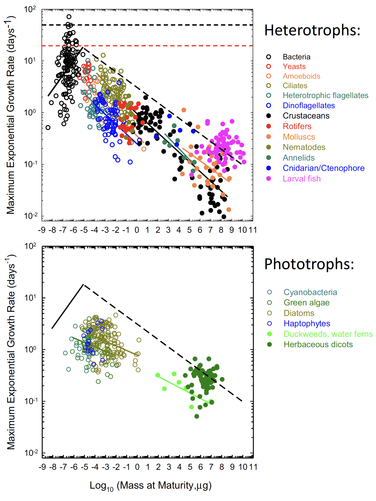
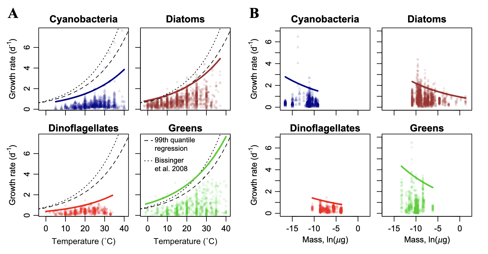

```{r setup, include=FALSE}


library(ape)
library(DESeq2)
library(DiagrammeR)
library(DiagrammeRsvg)
require(emo)
library(extrafont)
library(geiger)
require(icons)
library(kableExtra)
require(knitr)
library(lattice)
library(nlme)
library(phytools)
library(raster)
require(rmarkdown)
library(rsvg)
library(scales)
library(vioplot)
require(xaringan)
require(xaringanExtra)


options(htmltools.dir.version = FALSE)
# preset code chunk options
knitr::opts_chunk$set(dpi = 300,            # ensures high resolution images
                      echo = FALSE,         # FALSE: code chunks don't show
                      warning = FALSE,      # FALSE: suppresses warning messages
                      error = FALSE,       # FALSE: Suppresses error messages
                      fig.align = "center")

```


```{css, echo=FALSE}


pre {
  max-height: 200px;
  overflow-y: visible;
  overflow-x: visible;
  scrollbar-color: #007 #bada55;
}

pre[class] {
  max-height: 100px;
}


.scroll-100 {
  max-height: 100px;
  overflow-y: visible;

}


```


```{r, xaringan-slide-tone, echo = TRUE, include = FALSE}

xaringanExtra::use_slide_tone()

```


# Outline

<br/>


## Relationship between growth and size

- Theoretical predictions
- Empirical support

--

## Description of the data

- Phylogenetic representation
- Sample size
- Size range

--

## Current evidence

- Striking observations
- Analysis of findings


---
class: center, middle
background-image: url("imgs/bg-img.png")

# Evolution of growth and size

---


.pull-left[


<center>

 <br>

Lynch et al., (2022)

</center>


]

--


.pull-right[

<center>

 <br>

Nielsen, (2006)

</center>

]


---


```{r, include = FALSE}


tree <- read.tree("../spp.tree.nwk")

data <- read.csv("../condensed_traits_NCBI.csv")


vol <- read.csv("../cell_volume.csv")
str(vol)
head(vol)

spp.d1_lo <- data[!is.na(data$d1_lo), ]
spp.d1_up <- data[!is.na(data$d1_up), ]
spp.doubling <- data[!is.na(data$doubling_h), ]
spp.rRNA <- data[!is.na(data$rRNA16S_genes), ]
spp.tRNA <- data[!is.na(data$tRNA_genes), ]


tRNA <- aggregate(spp.tRNA$tRNA_genes, by = list(spp.tRNA$species), mean, na.action = na.rm)
rRNA <- aggregate(spp.rRNA$rRNA16S_genes, by = list(spp.rRNA$species), mean, na.action = na.rm)
d1_up <- aggregate(spp.d1_up$d1_up, by = list(spp.d1_up$species), mean, na.action = na.rm)
d1_lo <- aggregate(spp.d1_lo$d1_lo, by = list(spp.d1_lo$species), mean, na.action = na.rm)
doubling <- aggregate(spp.doubling$doubling_h, by = list(spp.doubling$species), mean, na.action = na.rm)
cell.vol <- aggregate(vol$volume, by = list(vol$species), mean)
str(cell.vol)


dim(tRNA)
names(tRNA) <- c("species", "tRNA")
dim(rRNA)
names(rRNA) <- c("species", "rRNA")
dim(d1_up)
names(d1_up) <- c("species", "d1_up")
dim(d1_lo)
names(d1_lo) <- c("species", "d1_lo")
dim(doubling)
names(doubling) <- c("species", "doubling_h")
dim(cell.vol)
names(cell.vol) <- c("species", "volume")


```


```{r, include = FALSE}


## Cell Volume


doubling <- aggregate(spp.doubling$doubling_h, by = list(spp.doubling$species), mean, na.action = na.rm)
cell.vol <- aggregate(vol$volume, by = list(vol$species), mean)
str(cell.vol)

dim(doubling)
names(doubling) <- c("species", "doubling_h")
dim(cell.vol)
names(cell.vol) <- c("species", "volume")


obj <- rep()
for(i in cell.vol$species){
    kingdom <- data$superkingdom[data$species == i][1]
    obj <- c(obj, kingdom)
}

cell.vol$kingdom <- obj
cell.vol$kingdom[11] <- "Bacteria"

doubling$species <- gsub("[[:punct:]]", "", doubling$species)
doubling$species <- gsub(" ", "_", doubling$species)
cell.vol$species <- gsub(" ", "_", cell.vol$species)

v.dat <- merge(cell.vol, doubling, by = "species")
v.dat <- v.dat[!v.dat$species == "Sphingopyxis_alaskensis", ] ## possible outlier
v.dat <- v.dat[!v.dat$species == "Anabaena_cylindrica", ] ## possible outlier
v.dat <- v.dat[!v.dat$species == "Haloferax_volcanii", ] ## possible outlier
v.dat <- v.dat[!v.dat$species == "Azotobacter_chroococcum", ] ## possible outlier
rownames(v.dat) <- v.dat$species

vol.tree <- read.tree("vol.spp.nwk")
vol.tree <- force.ultrametric(vol.tree)

check <- name.check(vol.tree, v.dat)
rm_phy <- check$tree_not_data
rm_dat <- check$data_not_tree
tree.vol <- drop.tip(vol.tree, rm_phy)

vol.dat <- subset(v.dat, subset = v.dat$species %in% tree.vol$tip, select = names(v.dat))
name.check(tree.vol, vol.dat)
str(vol.dat)

```

.pull-left[

```{r}

## Growth and volume


#plotTree(tree.vol, ftype = "i", lwd = 2, mar = c(1, 1, 1, 3))
#nodelabels(cex = 0.5, bg = "white")
#vol.dat

col.br <- setNames(c("purple", "orange"), c("Archaea", "Bacteria"))

plotTree(tree.vol, ftype = "i", lwd = 3, mar = c(1, 1, 1, 0.3))

par(new = TRUE, col = "transparent")

painted <- paintSubTree(tree.vol, 52, "Archaea" ,"0")
plotSimmap(painted, col.br, ftype = "i", lwd = 3, mar = c(1, 1, 1, 0.3))

par(new = TRUE, col = "transparent")

painted <- paintSubTree(tree.vol, 31, "Bacteria")

plotSimmap(painted, col.br, ftype = "i", lwd = 3, mar = c(1, 1, 1, 0.3))

par(new = TRUE, col = "black")

legend("bottomleft", legend = c("Archaea", "Bacteria"), lwd = 3, col = col.br, bty = "n")


```

]

--

.pull-right[


```{r}

mod <- lm(log10(doubling_h) ~ log10(volume), data = v.dat)
#summary(mod)

pg.mod <- gls(log10(doubling_h) ~ log10(volume), correlation = corBrownian(phy = tree.vol, form = ~species), data = vol.dat, method = "ML")
#summary(pg.mod)

## IC

SSX <- sum(round((log10(vol.dat$volume) - mean(log10(vol.dat$volume)))^2), 2)
s2 <- var(log10(vol.dat$doubling_h))
n <- length(vol.dat$doubling_h)
x <- seq(min(log10(vol.dat$volume)), max(log10(vol.dat$volume)), length = length(vol.dat$species))
m.x <- mean(round(log(vol.dat$volume), 1))
se <- sqrt(s2*((1/n) + (((x - m.x)^2)/SSX)))
is <- qt(0.975, df = n - 2)
ii <- qt(0.025, df = n - 2)
ic.s <- se*is
ic.i <- se*ii
upper.i <- (coef(pg.mod)[1] + coef(pg.mod)[2]*x) + ic.s
lower.i <- (coef(pg.mod)[1] + coef(pg.mod)[2]*x) + ic.i


cols <- setNames(c("purple", "orange"), levels(as.factor(vol.dat$kingdom)))
vol.dat$kingdom <- as.factor(vol.dat$kingdom)

#plot(log10(doubling_h) ~ log10(volume), data = v.dat, type = "p", pch = 16, las = 1, ylab = expression(paste("Doubling")~log[10]*(h)), xlab = expression(paste("Cell volume")~log[10]*(mu*m^3)), type = "n")

plot(log10(doubling_h) ~ log10(volume), data = vol.dat, type = "n", pch = 16, las = 1, ylab = expression(paste("Doubling ", log[10], sep = " ")*(h)), xlab = expression(paste("Cell volume ", log[10], sep = " ")(mu*m^3)))

grid(nx = NULL, ny = NULL, col = alpha("lightgray", 0.5), lwd = 1, lty = 2)

par(new = TRUE)

plot(log10(doubling_h) ~ log10(volume), data = vol.dat, type = "p", pch = 16, col = cols[vol.dat$kingdom], bg = cols[vol.dat$kingdom], las = 1, ylab = "", xlab = "", axes = FALSE)

lines(x, y = (coef(pg.mod)[1] + coef(pg.mod)[2]*x), lwd = 2)
polygon(c(rev(x), x), c(rev(lower.i), upper.i), border = FALSE, col = alpha("gold", 0.3))

legend("topright", legend = paste("n =", length(vol.dat$species), sep = " "), bty = "n")
legend("bottomleft", legend = unique(vol.dat$kingdom), pch = 16, col = cols, bg = cols, bty = "n")

```

]


```{r, include = FALSE}

layout(matrix(c(1, 1, 2, 2,
                1, 1, 2, 2,
                3, 3, 4, 4,
                3, 3, 4, 4), nrow = 4, ncol = 4, byrow = TRUE))

plot(mod, las = 1)

```

---
class: center, middle
background-image: url("imgs/ribosomes.jpeg")
background-size: cover


# Translation machinery


---


```{r, out.width = "60%"}

## Translation

tRNA <- aggregate(spp.tRNA$tRNA_genes, by = list(spp.tRNA$species), mean, na.action = na.rm)
rRNA <- aggregate(spp.rRNA$rRNA16S_genes, by = list(spp.rRNA$species), mean, na.action = na.rm)
cell.vol <- aggregate(vol$volume, by = list(vol$species), mean)

#dim(tRNA)
names(tRNA) <- c("species", "tRNA")
#dim(rRNA)
names(rRNA) <- c("species", "rRNA")
#dim(cell.vol)
names(cell.vol) <- c("species", "volume")

genes <- merge(rRNA, tRNA, by = "species")
tran <- merge(genes, cell.vol, by = "species")

obj <- rep()
for(i in tran$species){
    kingdom <- unique(data$superkingdom[data$species == i])
    obj <- c(obj, kingdom)
}

tran$kingdom <- obj
#head(tran)

tran$species <- gsub("[[:punct:]]", "", tran$species)
tran$species <- gsub(" ", "_", tran$species)
#head(tran)

tran <- tran[!tran$species == "Sphingopyxis_alaskensis", ] ## possible outlier
rownames(tran) <- tran$species

tran.tree <- read.tree("tran.spp.nwk")
#tran.tree <- force.ultrametric(tran.tree)

check <- name.check(tran.tree, tran)
rm_phy <- check$tree_not_data
rm_dat <- check$data_not_tree
tree.tran <- drop.tip(tran.tree, rm_phy)

tran.dat <- subset(tran, subset = tran$species %in% tree.tran$tip, select = names(tran))
#name.check(tree.tran, tran.dat)
#str(tran.dat)

##mod2 <- lm(log10(rRNA) ~ log10(volume)*log10(tRNA), data = tran.dat)
#summary(mod2)

mod3 <- lm(log10(rRNA) ~ log10(volume), data = tran.dat)
#summary(mod3)

mod4 <- lm(log10(tRNA) ~ log10(volume), data = tran.dat)
#summary(mod4)

#mod2 <- gls(log10(rRNA) ~ log10(volume)*log10(tRNA), correlation = corBrownian(phy = tree.tran, form = ~species), data = tran.dat, method = "ML")
#summary(mod2)

#mod3 <- gls(log10(rRNA) ~ log10(volume), correlation = corBrownian(phy = tree.tran, form = ~species), data = tran.dat, method = "ML")
#summary(mod3)

#mod4 <- gls(log10(tRNA) ~ log10(volume), correlation = corBrownian(phy = tree.tran, form = ~species), data = tran.dat, method = "ML")
#summary(mod4)


SSX <- sum(round((log10(tran.dat$volume) - mean(log10(tran.dat$volume)))^2), 2)
s2 <- var(log10(tran.dat$rRNA))
n <- length(tran.dat$rRNA)
x <- seq(min(log10(tran.dat$volume)), max(log10(tran.dat$volume)), length = length(tran.dat$species))
m.x <- mean(round(log(tran.dat$volume), 1))
se <- sqrt(s2*((1/n) + (((x - m.x)^2)/SSX)))
is <- qt(0.975, df = n - 2)
ii <- qt(0.025, df = n - 2)
ic.s <- se*is
ic.i <- se*ii
upper.i <- (coef(mod3)[1] + coef(mod3)[2]*x) + ic.s
lower.i <- (coef(mod3)[1] + coef(mod3)[2]*x) + ic.i


cols2 <- setNames(c("purple", "orange"), levels(as.factor(tran.dat$kingdom)))

plot(log10(rRNA) ~ log10(volume), data = tran.dat, type = "n", pch = 16, las = 1, ylab = expression(log[10]~rRNA), xlab = expression(paste("Cell volume ", log[10], sep = " ")(mu*m^3)))

grid(nx = NULL, ny = NULL, col = alpha("lightgray", 0.5), lwd = 1, lty = 2)

par(new = TRUE)

plot(log10(rRNA) ~ log10(volume), data = tran.dat, type = "p", pch = 16, col = cols2[tran.dat$kingdom], bg = cols2[tran.dat$kingdom], las = 1, axes = FALSE, xaxt = "n", ylab = "", xlab = "")

lines(x = x, y = (coef(mod3)[1] + coef(mod3)[2]*x), lwd = 2)
polygon(c(rev(x), x), c(rev(lower.i), upper.i), border = FALSE, col = alpha("gold", 0.1))


```


---


```{r, out.width = "60%"}

## Translation

tRNA <- aggregate(spp.tRNA$tRNA_genes, by = list(spp.tRNA$species), mean, na.action = na.rm)
rRNA <- aggregate(spp.rRNA$rRNA16S_genes, by = list(spp.rRNA$species), mean, na.action = na.rm)
cell.vol <- aggregate(vol$volume, by = list(vol$species), mean)

#dim(tRNA)
names(tRNA) <- c("species", "tRNA")
#dim(rRNA)
names(rRNA) <- c("species", "rRNA")
#dim(cell.vol)
names(cell.vol) <- c("species", "volume")

genes <- merge(rRNA, tRNA, by = "species")
tran <- merge(genes, cell.vol, by = "species")

obj <- rep()
for(i in tran$species){
    kingdom <- unique(data$superkingdom[data$species == i])
    obj <- c(obj, kingdom)
}

tran$kingdom <- obj
#head(tran)

tran$species <- gsub("[[:punct:]]", "", tran$species)
tran$species <- gsub(" ", "_", tran$species)
#head(tran)

tran <- tran[!tran$species == "Sphingopyxis_alaskensis", ] ## possible outlier
rownames(tran) <- tran$species

tran.tree <- read.tree("tran.spp.nwk")
#tran.tree <- force.ultrametric(tran.tree)

check <- name.check(tran.tree, tran)
rm_phy <- check$tree_not_data
rm_dat <- check$data_not_tree
tree.tran <- drop.tip(tran.tree, rm_phy)

tran.dat <- subset(tran, subset = tran$species %in% tree.tran$tip, select = names(tran))
#name.check(tree.tran, tran.dat)
#str(tran.dat)

##mod2 <- lm(log10(rRNA) ~ log10(volume)*log10(tRNA), data = tran.dat)
#summary(mod2)

mod3 <- lm(log10(rRNA) ~ log10(volume), data = tran.dat)
#summary(mod3)

mod4 <- lm(log10(tRNA) ~ log10(volume), data = tran.dat)
#summary(mod4)

#mod2 <- gls(log10(rRNA) ~ log10(volume)*log10(tRNA), correlation = corBrownian(phy = tree.tran, form = ~species), data = tran.dat, method = "ML")
#summary(mod2)

#mod3 <- gls(log10(rRNA) ~ log10(volume), correlation = corBrownian(phy = tree.tran, form = ~species), data = tran.dat, method = "ML")
#summary(mod3)

#mod4 <- gls(log10(tRNA) ~ log10(volume), correlation = corBrownian(phy = tree.tran, form = ~species), data = tran.dat, method = "ML")
#summary(mod4)


SSX <- sum(round((log10(tran.dat$volume) - mean(log10(tran.dat$volume)))^2), 2)
s2 <- var(log10(tran.dat$rRNA))
n <- length(tran.dat$rRNA)
x <- seq(min(log10(tran.dat$volume)), max(log10(tran.dat$volume)), length = length(tran.dat$species))
m.x <- mean(round(log(tran.dat$volume), 1))
se <- sqrt(s2*((1/n) + (((x - m.x)^2)/SSX)))
is <- qt(0.975, df = n - 2)
ii <- qt(0.025, df = n - 2)
ic.s <- se*is
ic.i <- se*ii
upper.i <- (coef(mod3)[1] + coef(mod3)[2]*x) + ic.s
lower.i <- (coef(mod3)[1] + coef(mod3)[2]*x) + ic.i

cols2 <- setNames(c("purple", "orange"), levels(as.factor(tran.dat$kingdom)))

plot(log10(rRNA) ~ log10(volume), data = tran.dat, type = "n", pch = 16, las = 1, ylab = expression(log[10]~rRNA), xlab = expression(paste("Cell volume ", log[10], sep = " ")(mu*m^3)))

grid(nx = NULL, ny = NULL, col = alpha("lightgray", 0.5), lwd = 1, lty = 2)

par(new = TRUE)

plot(log10(rRNA) ~ log10(volume), data = tran.dat, type = "p", pch = 16, col = cols2[tran.dat$kingdom], bg = cols2[tran.dat$kingdom], las = 1, axes = FALSE, xaxt = "n", ylab = "", xlab = "")

lines(x = x, y = (coef(mod3)[1] + coef(mod3)[2]*x), lwd = 2)
polygon(c(rev(x), x), c(rev(lower.i), upper.i), border = FALSE, col = alpha("gold", 0.1))


par(new = TRUE)

plot(log10(tRNA) ~ log10(volume), data = tran.dat, type = "n", pch = 16, col = cols2[tran.dat$kingdom], bg = cols2[tran.dat$kingdom], las = 1, axes = FALSE, xaxt = "n", ylab = "", xlab = "")

SSX <- sum(round((log10(tran.dat$volume) - mean(log10(tran.dat$volume)))^2), 2)
s2 <- var(log10(tran.dat$tRNA))
n <- length(tran.dat$tRNA)
x <- seq(min(log10(tran.dat$volume)), max(log10(tran.dat$volume)), length = length(tran.dat$species))
m.x <- mean(round(log(tran.dat$volume), 1))
se <- sqrt(s2*((1/n) + (((x - m.x)^2)/SSX)))
is <- qt(0.975, df = n - 2)
ii <- qt(0.025, df = n - 2)
ic.s <- se*is
ic.i <- se*ii
upper.i <- (coef(mod4)[1] + coef(mod4)[2]*x) + ic.s
lower.i <- (coef(mod4)[1] + coef(mod4)[2]*x) + ic.i


lines(x = x, y = (coef(mod4)[1] + coef(mod4)[2]*x), lwd = 2, lty = 2)
polygon(c(rev(x), x), c(rev(lower.i), upper.i), border = FALSE, col = alpha("gold", 0.1))

legend("topleft", legend = paste("n = ", length(tran.dat$species), sep = " "), bty = "n")
legend(x = -2.5, y = 2.1, legend = "tRNA genes", lty = 2, bty = "n")
legend("bottomright", legend = levels(as.factor(tran.dat$kingdom)), pch = 16, col = cols2, bg = cols2, bty = "n") 


```

---
class: center, middle
background-image: url("imgs/temp.jpeg")
background-size: cover

How does temperature scale with size and growth?

---


<br>

<center>
 
 Kremer et al., (2017)
 
 </center>


---

```{r, out.width = "60%"}

## Relationship between diameter and volume

d1_up <- aggregate(spp.d1_up$d1_up, by = list(spp.d1_up$species), mean, na.action = na.rm)
cell.vol <- aggregate(vol$volume, by = list(vol$species), mean)

#dim(d1_up)
names(d1_up) <- c("species", "d1_up")
#dim(cell.vol)
names(cell.vol) <- c("species", "volume")


d1_up$species <- gsub("[[:punct:]]", "", d1_up$species)
d1_up$species <- gsub(" ", "_", d1_up$species)
cell.vol$species <- gsub(" ", "_", cell.vol$species)

di.vol <- merge(cell.vol, d1_up, by = "species")

#cor(log10(di.vol$volume), di.vol$d1_up, method = c("pearson"))

plot(log10(volume) ~ d1_up, data = di.vol, pch = 16, las = 1, ylab = expression(paste("Cell volume ", log[10], sep = " ")(mu*m^3)), xlab = expression(paste("Cell diameter ", log[10], sep = " ")(mu*m)), mgp = c(2.6, 1, 0))

grid(nx = NULL, ny = NULL, col = alpha("lightgray", 0.5), lwd = 1, lty = 2)

abline(lm(log10(di.vol$volume) ~ di.vol$d1_up), lwd = 2)
legend(x = 0.1, y = 2.3, legend = expression(R^2), bty = "n")
legend(x = 0.2, y = 2.3, legend = paste("=", round((cor(log(di.vol$volume), di.vol$d1_up, method = "pearson"))^2, 2), sep = " "), bty = "n")


```


---


```{r, include = FALSE}

## Optimum temp

spp.d1_up <- data[!is.na(data$d1_up), ]
spp.temp.op <- data[!is.na(data$optimum_tmp), ]
spp.growth_temp <- data[!is.na(data$growth_tmp), ]
spp.doubling <- data[!is.na(data$doubling_h), ]

d1_up <- aggregate(spp.d1_up$d1_up, by = list(spp.d1_up$species), mean, na.action = na.rm)
doubling <- aggregate(spp.doubling$doubling_h, by = list(spp.doubling$species), mean, na.action = na.rm)
temp.op <- aggregate(spp.temp.op$optimum_tmp, by = list(spp.temp.op$species), mean, na.action = na.rm)
growth_temp <- aggregate(spp.growth_temp$growth_tmp, by = list(spp.growth_temp$species), mean, na.action = na.rm)

dim(doubling)
dim(doubling)
names(doubling) <- c("species", "doubling_h")
dim(d1_up)
names(d1_up) <- c("species", "d1_up")
dim(temp.op)
names(temp.op) <- c("species", "tmp.op")
dim(growth_temp)
names(growth_temp) <- c("species", "growth_tmp")


mrg.tmp <- merge(temp.op, growth_temp, by = "species")
str(mrg.tmp)


mrg.tmp <- mrg.tmp[mrg.tmp$growth_tmp == mrg.tmp$tmp.op, ]

mrg.tmp.op2 <- merge(mrg.tmp, d1_up, by = "species")
str(mrg.tmp.op2)


mrg.tmp.op3 <- merge(mrg.tmp.op2, doubling, by = "species")
str(mrg.tmp.op3)


obj <- rep()
for(i in mrg.tmp.op2$species){
    kingdom <- unique(data$superkingdom[data$species == i])
    obj <- c(obj, kingdom)
}

mrg.tmp.op2$kingdom <- obj
head(mrg.tmp.op2)

mrg.tmp.op2$species <- gsub("[[:punct:]]", "", mrg.tmp.op2$species)
mrg.tmp.op2$species <- gsub(" ", "_", mrg.tmp.op2$species)
rownames(mrg.tmp.op2) <- mrg.tmp.op2$species
head(mrg.tmp.op2$species)

check <- name.check(tree, mrg.tmp.op2)
rm_phy <- check$tree_not_data
rm_dat <- check$data_not_tree
tree.tmp <- drop.tip(tree, rm_phy)

tmp.dat <- subset(mrg.tmp.op2, subset = mrg.tmp.op2$species %in% tree.tmp$tip, select = names(mrg.tmp.op2))
name.check(tree.tmp, tmp.dat)

obj <- rep()
for(i in mrg.tmp.op3$species){
    kingdom <- unique(data$superkingdom[data$species == i])
    obj <- c(obj, kingdom)
}

mrg.tmp.op3$kingdom <- obj
head(mrg.tmp.op3)

mrg.tmp.op3$species <- gsub("[[:punct:]]", "", mrg.tmp.op3$species)
mrg.tmp.op3$species <- gsub(" ", "_", mrg.tmp.op3$species)
rownames(mrg.tmp.op3) <- mrg.tmp.op3$species
head(mrg.tmp.op3$species)

check <- name.check(tree, mrg.tmp.op3)
rm_phy <- check$tree_not_data
rm_dat <- check$data_not_tree
tree.tmp2 <- drop.tip(tree, rm_phy)

tmp.dat2 <- subset(mrg.tmp.op3, subset = mrg.tmp.op3$species %in% tree.tmp2$tip, select = names(mrg.tmp.op3))
name.check(tree.tmp2, tmp.dat2)


```


```{r, out.width = "60%", include = FALSE}


tmp.op <- setNames(log(tmp.dat$tmp.op), rownames(tmp.dat))

fit <- fastAnc(tree.tmp, tmp.op, vars = TRUE, CI = TRUE)

obj <- contMap(tree.tmp, tmp.op, plot = FALSE)

plotTree(tree.tmp, ftype = "off", lwd = 2, mar = c(3.5, 1.5, 1.5, 0.5), plot = FALSE)

cladelabels(tree.tmp, text = c("Archaea", "Bacteria"), node = c(518, 279))

par(new = TRUE)

plot(obj, ftype = "off", legend = FALSE, ylim = c(1-0.09*(Ntip(obj$tree)-1), Ntip(obj$tree)), lwd = 2, mar = c(1, 1.5, 1.5, 1.5))

add.color.bar(1200, obj$cols, title = expression(paste("Optimum temperature ")~log[10]), lims = obj$lims, digits = 3, prompt = FALSE, x = 0, y = 1-0.02*(Ntip(obj$tree)-1), lwd = 4, fsize = 0.6, subtitle = "")


axisPhylo(1, line = -2.3)
mtext("Time (mya)", side = 1)


```


.pull-left[


```{r}

## Cell size and temp opt

tmp.dat <- tmp.dat[tmp.dat$d1_up < 2, ]

#model6 <- gls(d1_up ~ log10(tmp.op), correlation = corBrownian(phy = tree.tmp, form = ~species), data = tmp.dat, method = "ML")

model6 <- lm(d1_up ~ log10(tmp.op), data = tmp.dat)


## IC

SSX <- sum(round((log10(tmp.dat$tmp.op) - mean(log10(tmp.dat$tmp.op)))^2), 2)
s2 <- var(tmp.dat$d1_up)
n <- length(tmp.dat$d1_up)
x <- seq(min(log10(tmp.dat$tmp.op)), max(log10(tmp.dat$tmp.op)), length = 30)
m.x <- mean(round(log10(tmp.dat$tmp.op), 1))
se <- sqrt(s2*((1/n) + (((x - m.x)^2)/SSX)))
is <- qt(0.975, df = n - 2)
ii <- qt(0.025, df = n - 2)
ic.s <- se*is
ic.i <- se*ii
upper.i <- (coef(model6)[1] + coef(model6)[2]*x) + ic.s
lower.i <- (coef(model6)[1] + coef(model6)[2]*x) + ic.i


plot(d1_up ~ log10(tmp.op), data = tmp.dat, ylab = expression(paste("Cell diameter ", log[10], sep = " ")(mu*m)), xlab = expression(paste("Optimum temperature \u00B0C")~(log[10])), las = 1, pch = 21, cex = 1.2, type = "n")

grid(nx = NULL, ny = NULL, col = alpha("lightgray", 0.5), lwd = 1, lty = 2)

par(new = TRUE)

cols <- setNames(c("purple", "orange"), levels(as.factor(tmp.dat$kingdom)))

plot(d1_up ~ log10(tmp.op), data = tmp.dat, xlab = "", ylab = "", las = 1, pch = 21, col = cols[tmp.dat$kingdom], bg = cols[tmp.dat$kingdom], cex = 0.8, axes = FALSE)

#lines(x = x, y = (coef(model6)[1] + coef(model6)[2]*x), lwd = 2, col = "black")
#polygon(c(rev(x), x), c(rev(lower.i), upper.i), border = FALSE, col = alpha("gold", 0.3))

legend("topleft", legend = levels(as.factor((tmp.dat$kingdom))), pch = 16, col = c("purple", "orange"), bg = c("purple", "orange"), bty = "n")


```

]

--

.pull-right[

```{r}


## Doubling and temp

#model7 <- gls(log(doubling_h) ~ log(tmp.op), correlation = corBrownian(phy = tree.tmp2, form = ~species), data = tmp.dat2, method = "ML")

model7 <- lm(log10(doubling_h) ~ log10(tmp.op), data = tmp.dat2)

## IC

SSX <- sum(round((log10(tmp.dat2$tmp.op) - mean(log10(tmp.dat2$tmp.op)))^2), 2)
s2 <- var(log10(tmp.dat2$doubling_h))
n <- length(log10(tmp.dat2$doubling_h))
x <- seq(min(log10(tmp.dat2$tmp.op)), max(log10(tmp.dat2$tmp.op)), length = 30)
m.x <- mean(round(log10(tmp.dat2$tmp.op), 1))
se <- sqrt(s2*((1/n) + (((x - m.x)^2)/SSX)))
is <- qt(0.975, df = n - 2)
ii <- qt(0.025, df = n - 2)
ic.s <- se*is
ic.i <- se*ii
upper.i <- (coef(model7)[1] + coef(model7)[2]*x) + ic.s
lower.i <- (coef(model7)[1] + coef(model7)[2]*x) + ic.i


plot(log10(doubling_h) ~ log10(tmp.op), data = tmp.dat2, ylab = expression(paste("Doubling ", log[10], sep = " ")(h)), xlab = expression(paste("Optimum temperature \u00B0C ")~(log[10])), las = 1, pch = 21, bg = alpha("black", 0.3), cex = 1.2, type = "n")

grid(nx = NULL, ny = NULL, col = alpha("lightgray", 0.5), lwd = 1, lty = 2)

par(new = TRUE)

cols3 <- c("purple", "orange")[as.numeric(as.factor(tmp.dat2$kingdom))]

plot(log10(doubling_h) ~ log10(tmp.op), data = tmp.dat2, xlab = "", ylab = "", las = 1, pch = 21, col = cols3, bg = cols3, cex = 0.8, axes = FALSE)

lines(x = x, y = (coef(model7)[1] + coef(model7)[2]*x), lty = 2, lwd = 2, col = "black")
polygon(c(rev(x), x), c(rev(lower.i), upper.i), border = FALSE, col = alpha("gold", 0.3))

legend("bottomleft", legend = levels(as.factor((tmp.dat2$kingdom))), pch = 16, col = c("purple", "orange"), bg = c("purple", "orange"), bty = "n")


```


]
